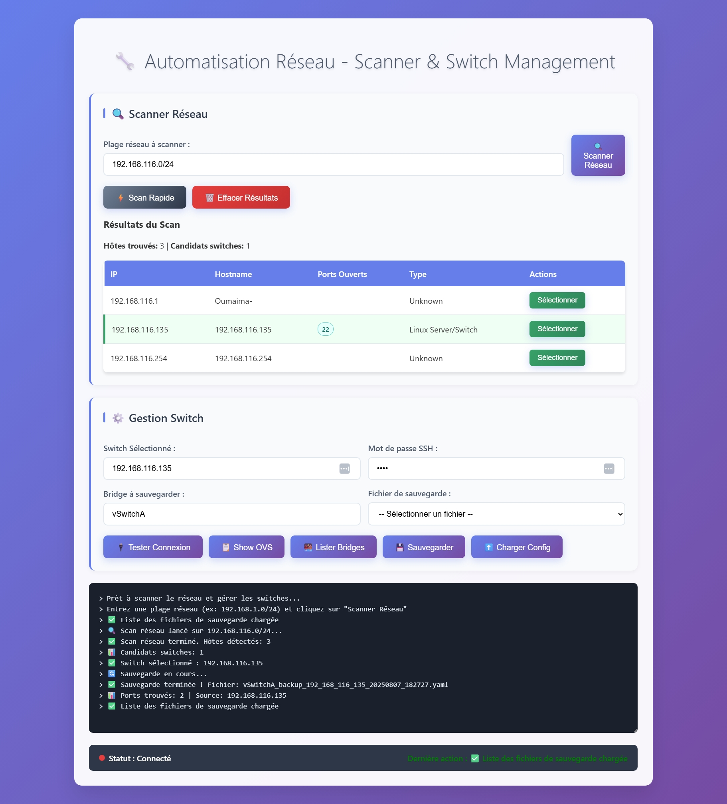

# Automatisation Réseau - Interface Switch

Ce projet est une interface web d'automatisation réseau permettant de gérer la configuration de switches Open vSwitch (OVS) via SSH.  
L'interface offre les fonctionnalités suivantes :

- Affichage complet de la configuration Open vSwitch.
- Sauvegarde des configurations spécifiques d’un switch.
- Chargement/restauration d'une configuration sauvegardée sur un switch.
- Génération de rapports (fonctionnalité à implémenter).
- Console interactive pour afficher les commandes et leurs résultats.
- Statut de connexion et retour d'état des actions en temps réel.

## Fonctionnalités principales

- Connexion sécurisée au switch via SSH avec mot de passe.
- Sélection du switch à sauvegarder et gestion des fichiers de sauvegarde.
- Sauvegarde des données OVS (ponts, ports, interfaces) au format YAML.
- Chargement dynamique des fichiers de sauvegarde disponibles.
- Interface responsive, simple et intuitive.

## Installation

1. Clonez ce dépôt :
   ```bash
   git clone https://github.com/oumnou/oumnou-ocp-network-automation
   cd network-automation-tool
````

2. Installez les dépendances Python (Flask, PyYAML, paramiko) :

   ```bash
   pip install -r requirements.txt
   ```

3. Lancez l’application Flask :

   ```bash
   python app.py
   ```

4. Ouvrez votre navigateur sur [http://localhost:5000](http://localhost:5000)

## Structure du projet

```
/
├── app.py               # Point d'entrée Flask
├── services/            # Fonctions utilitaires (SSH, parsing OVS)
├── routes/              # Routes API Flask
├── backup/              # Sauvegardes YAML des configurations OVS
├── static/              # Fichiers CSS et JS
└── templates/           # Pages HTML
```

## Utilisation

* Renseignez l’adresse IP du switch (fixée pour le moment).
* Entrez le mot de passe SSH pour la connexion.
* Indiquez le nom du switch à sauvegarder.
* Cliquez sur **Sauvegarder Config** pour créer un backup YAML.
* Sélectionnez un fichier de sauvegarde et un nom de nouveau switch pour restaurer une config.
* Utilisez le bouton **Show Open vSwitch** pour afficher la configuration actuelle.

## Capture d'écran



---

## À venir

* Implémentation de la génération automatique de rapports.
* Support multi-switch et gestion des utilisateurs.
* Intégration avec nmap pour scan réseau (optionnel).

---

## Auteur

Oumaima Nouini
Étudiante en cybersécurité et automation réseau.

---

## Licence

Ce projet est sous licence MIT.
Voir le fichier [LICENSE](LICENSE).

```


